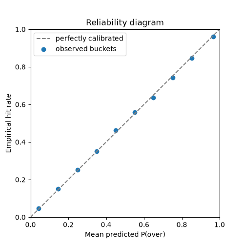
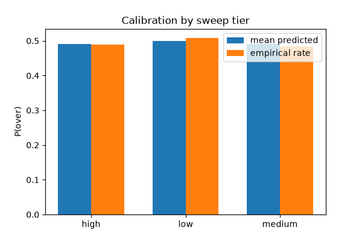
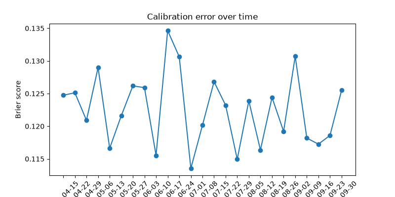

# OddsOptimizer

An analytics project that builds a baseline ML model for MLB pitcher strikeout props. This is a research and engineering portfolio project — it is **not** betting advice, and no part of it executes real wagers.

## Results

Track A (model honesty — how well-calibrated are the raw probabilities against historical outcomes, with no line/market involved) has a full walk-forward backtest behind it, reported as of 2026-06-30 in [`reports/2026-06-30-baseline-backtest.md`](reports/2026-06-30-baseline-backtest.md):

- **4,268** out-of-sample starts evaluated (expanding-window walk-forward, weekly steps, 2024 season)
- Point accuracy: **MAE 1.794**, **RMSE 2.236**
- Expected calibration error (ECE): **0.006** — a well-calibrated model's ECE should be close to 0
- Brier score at the 7+ threshold: **0.171**; log loss: **0.517**





A candidate "compression fix" (an Empirical-Bayes-stabilized K-rate feature meant to correct under-prediction at the high end of the distribution) was tested and **rejected** — see [`reports/2026-06-30-compression-matchup-fix.md`](reports/2026-06-30-compression-matchup-fix.md) for the full gate reasoning. The production model is the baseline feature set.

Track B (pick profitability — hit rate and real-EV ROI against actual posted lines) is a forward-only record that starts accumulating the day the live pipeline goes live; it cannot be backfilled since neither prior line source publishes historical odds. As of the last generated report it had 0 settled picks — genuinely too early to read anything into. [`src/backtest/report.py`](src/backtest/report.py) regenerates this report from the accumulated `data/processed/outcomes/` partitions as picks settle.

## Project goal

For a starting pitcher's upcoming game, predict the probability of going over each posted threshold for a given prop (e.g. strikeouts 1+ through 10+), bucket each prediction into one of 3 confidence tiers, and honestly evaluate those probabilities against real outcomes over time (hit rate, calibration, and a real-EV ROI backtest against the market).

Strikeouts is the first prop built end-to-end; pitching outs, earned runs allowed, and walks allowed follow once that pipeline is validated.

## Why MLB pitcher props

- **Sport:** MLB — in season now, and `pybaseball` / the MLB Stats API provide rich, free, no-key pitcher and batter data that updates same-day.
- **Props:** strikeouts, pitching outs, earned runs allowed, walks allowed — all count-based stats with a free, two-sided line source (Underdog Fantasy's public pick'em feed).
- **Target:** per-threshold P(over) from a predicted count distribution (Poisson / negative-binomial regression), not raw hit-rate or ROI. Hit rate and ROI are noisy evaluation metrics, not good training targets.

Full reasoning, including the 2026-06-27 and 2026-08 line-source changes, is logged in [`docs/decision_log.md`](docs/decision_log.md).

## Data sources

See [`docs/data_sources.md`](docs/data_sources.md) for the full list, what's free, and what's rate-limited.

- [pybaseball](https://github.com/jldbc/pybaseball) — Statcast pitch-level data, pitcher game logs (free, no key)
- [MLB-StatsAPI](https://github.com/toddrob99/MLB-StatsAPI) — probable pitchers, live boxscores, rosters (free, no key)
- Underdog Fantasy's public pick'em feed — current two-sided prop lines, no key required, unofficial (primary and only line source)

**Why the line source changed:** the project originally used PrizePicks' public projections endpoint, which posted a single flat line per prop with no priced odds. That endpoint now permanently returns HTTP 403 (bot protection), and separately, PrizePicks had already replaced its standard/goblin/demon ladder with unpublished-payout two-sided alternates that no longer fit a fixed-payout edge calculation. Underdog posts a genuine two-sided over/under with real American odds and payout multipliers on both sides. That buys the model something PrizePicks' flat line never could: a **no-vig market probability** (`p_market`) computed directly from the two prices, so "edge" is now `p_over − p_market` (an actual model-vs-market disagreement) instead of `p_over − 0.5` (a coinflip baseline), and the ROI backtest can compute real expected value from the posted payout multiplier instead of assuming flat even-money bets.

No raw datasets are committed to this repo — `data/` is gitignored. No API keys or credentials are stored in this repo, and none are required to run it.

## Quickstart

```bash
git clone https://github.com/Jason-Perez27/OddsOptimizer.git
cd OddsOptimizer
python -m venv venv
venv\Scripts\activate        # Windows; use `source venv/bin/activate` on macOS/Linux
pip install -r requirements.txt

# Sanity-check the live sources without writing anything:
python -m src.pipeline.refresh --dry-run

# Pull today's slate and write predictions/threshold_table/line_picks:
python -m src.pipeline.refresh

# Launch the local decision dashboard (opens http://127.0.0.1:8000):
python run_dashboard.py
```

If `refresh` reports fewer games than you expect early in the day, that's normal — Underdog posts its slate progressively through the morning, not all at once.

## Project structure

```
OddsOptimizer/
├── configs/            # config.yaml — Underdog feed config, prop thresholds, evaluation settings
├── data/                # gitignored — raw/ pulls, processed/ predictions+outcomes partitions, models/
├── docs/                # data sources, decision log, operator runbooks, design/ (dated design specs)
├── reports/              # dated backtest/results writeups + PNG charts
├── scripts/               # backtest runner, cadence wrapper, dashboard-HTML generator, feature gate tools
├── src/
│   ├── data/                # ingestion: pybaseball, MLB-StatsAPI, Underdog lines, weather, vegas, umpires
│   ├── features/             # feature engineering: rolling K-rate, opponent, park factor, lineup matchup
│   ├── models/                # baseline Poisson/NB GLM + gradient-boosted ensemble model
│   ├── predictions/            # tiering: threshold sweep, market pricing, edge, actionability
│   ├── pipeline/                # daily refresh, settlement, and live-source verification orchestration
│   ├── evaluation/                # grading + calibration/accuracy metrics
│   ├── backtest/                    # walk-forward backtest, ROI, conviction calibration, reports
│   └── serve/                        # dashboard data layer + stdlib HTTP server (+ static/ frontend)
├── tests/                # network-free unit tests against fixtures
├── run_dashboard.py       # entry point: launch the local decision dashboard
├── LICENSE
└── README.md
```

## Code walkthrough

Read in pipeline order — each subsection is roughly "what comes in, what comes out, who reads it next."

### `src/data/` — ingestion

- **`underdog_lines.py`** — the live line source. `fetch_over_under_lines(sport_id="MLB")` calls Underdog's public pick'em feed; `flatten_lines(payload, stat, sport_id)` joins the nested `over_under_lines → appearances → players + games` payload into one row per line with both sides' American odds and payout multipliers; `american_to_prob`, `no_vig_two_way`, and `payout_to_decimal` are the shared odds-conversion helpers used downstream for market pricing. Feeds the tiering/edge stage of `src/pipeline/refresh.py`.
- **`prizepicks_lines.py`** — decommissioned (2026-08). Kept as a historical record only; nothing in the pipeline imports it anymore.
- **`pitcher_logs.py`** — pulls a pitcher's season-to-date Statcast pitch logs via `pybaseball` (`get_pitcher_season_logs`, plus an id-based `get_pitcher_logs_by_id` used for settlement). Raw output feeds `src/features/game_logs.py`.
- **`probable_pitchers.py`** — fetches today's probable starters from MLB-StatsAPI (`fetch_schedule` + `parse_probable_starters`), answering "who's starting, for which team, against whom." Its slate output is the direct input to `src/features/predict_features.py`.
- **`statsapi_boxscore.py`** — pulls earned-runs-allowed labels from the StatsAPI boxscore (`get_pitcher_earned_runs_by_game`), since Statcast pitch data doesn't distinguish earned from unearned runs. Feeds the ER-rate rolling features.
- **`umpires.py`** — home-plate umpire strikeout-tendency lookup (`get_ump_k_factor`), combining a static historical CSV with the live day-of assignment; falls back to neutral (1.0) when the umpire is unknown or under-sampled. Feeds `baseline_model.py`'s matchup-candidate regressors.
- **`vegas.py`** — game total / favorite-underdog context from ESPN's public scoreboard (`get_game_odds`), free and key-free. Feeds `baseline_model.py`'s context-candidate regressors.
- **`weather.py`** — temperature/wind/humidity at first pitch from the free Open-Meteo API (`get_game_weather`), skipping the network call entirely for dome parks. Feeds the same context-candidate regressors as `vegas.py`.

### `src/features/` — feature engineering

- **`game_logs.py`** — first step: collapses pitch-level Statcast rows into one row per pitcher-game (`aggregate_pitcher_games`) — strikeouts, walks, batters faced, whiff rate, rest days, plate-discipline metrics. The base table everything else builds on.
- **`rolling_features.py`** — the largest feature module: `add_rolling_features` builds last-5/season/home/away/vs-opponent-career K-rate, BB-rate, ER-rate variants, plate-discipline rolling stats, and an Empirical-Bayes-stabilized `k_stab_last5`. All shift(1)-before-aggregate, so nothing leaks future information into a prior game's row.
- **`opponent_features.py`** — opposing-lineup matchup features: season/rolling opponent K-rate (`add_opponent_features`), plus a PA-slot-weighted lineup K-rate vs. the starter's throwing hand (`build_lineup_weighted_opp_k`) for the matchup-feature model variant.
- **`park_factors.py`** — `add_park_factors` computes a leakage-safe, strictly-prior ballpark strikeout index once enough games exist at a park this season, falling back to a static reference table early in the season.
- **`batter_logs.py`** — batter-side counterpart to `game_logs.py`: per-batter K-rate split by opposing-pitcher hand, feeding `opponent_features.py`'s lineup-weighted calculation.
- **`build_features.py`** — orchestrates the full historical training-table build (`build_training_table`): chains `game_logs` → `rolling_features` → `opponent_features` → `park_factors`, then validates required columns are never null. Feeds model training.
- **`predict_features.py`** — the label-less, "as-of-today" sibling of `build_features.py`: builds a synthetic today-row per slate starter, runs it through the same leakage-safe feature builders, then slices the synthetic rows back out. Feeds live predictions in `src/pipeline/refresh.py`.

### `src/models/` — the models

- **`baseline_model.py`** — the production model: a Poisson/Negative-Binomial GLM (`statsmodels`), auto-selected by an overdispersion test (`select_family`). Chronological (never random) train/test split, train-only imputation and standardization, joblib persistence with training metadata for staleness checks. Exposes `predict_over_prob`/`predict_over_prob_sweep` and shared evaluation helpers (`brier_score`, `log_loss`, etc.) reused by `src/evaluation/metrics.py`.
- **`boosted_model.py`** — a second, gradient-boosted model (`HistGradientBoostingRegressor`) predicting the same strikeout mean as an ensemble "second opinion," with per-threshold isotonic calibration and a GLM-vs-booster agreement signal (`compute_agreement`) for conviction scoring.

### `src/predictions/` — tiering and market pricing

- **`tiering.py`** — turns a fitted model's predicted mean into a per-threshold probability sweep (`build_threshold_table`), matches each pitcher to a live Underdog line (`resolve_pitcher_ids`, disambiguating same-named pitchers by team or by the game's away/home pair), and builds the final actionable pick (`build_line_picks`): no-vig market probability from the two-sided odds, edge (`p_over − p_market`, falling back to `p_over − 0.5` when a market price isn't available), a delta-method conviction score, and an actionability label.

### `src/pipeline/` — daily orchestration

- **`refresh.py`** — the morning job: pulls today's probable starters, Statcast history, Underdog lines, and context features (lineups, umpire, weather, Vegas), then writes `predictions.csv`, `threshold_table.csv`, `line_picks.csv`, `pitcher_cards.csv`, and `run_manifest.json` to `data/processed/predictions/game_date=.../`. A failed line-source fetch degrades gracefully to an empty `line_picks.csv` (flagged via `line_source_error` in the manifest) rather than aborting the whole run. `--dry-run` runs the verification gate below without writing anything.
- **`verify.py`** — the live-data verification gate: fetches each live source's raw payload and runs it through the real production parser to catch a schema drift before it corrupts a graded day, without writing anything itself. Called by `refresh --dry-run`.
- **`settle.py`** — the settlement job: reads a date's refresh partition, pulls realized Statcast outcomes, grades them, and writes `graded_line_picks.csv` / `graded_threshold_sweep.csv` to `data/processed/outcomes/game_date=.../`. Safely re-runnable — resolves `pending` → `settled`/`void_scratched` as new data lands.

### `src/evaluation/` — grading and honesty metrics

- **`grading.py`** — pure join/grading logic, matched on `(pitcher, game_pk)` (doubleheader-safe, never on date alone): assigns 3-way settlement status and grades both the single pick and the full threshold sweep against the realized outcome.
- **`metrics.py`** — model-honesty metrics on graded frames: reliability tables and expected calibration error, Brier/log-loss at a line or across thresholds, PIT histograms for discrete-count calibration, and point accuracy (MAE/RMSE). Feeds both backtest reports.

### `src/backtest/` — historical validation and pick-profitability

- **`corpus.py`** — assembles the windowed, resumably-cached historical Statcast corpus (`build_corpus`) that feeds the walk-forward backtest.
- **`walk_forward.py`** — expanding-window walk-forward backtest (`run_walk_forward`): trains on strictly-prior data, predicts the next window, accumulates out-of-sample predictions across the whole span. This is the Track A engine behind the Results numbers above.
- **`roi.py`** — pick-profitability: `hit_rate` and `flat_bet_roi` (real-EV ROI using Underdog's payout multipliers, falling back to a flat assumption for unpriced/pre-migration rows, with every row tagged `real_ev`/`flat_fallback` so the two eras are never silently mixed together).
- **`tail_calibration.py`** — diagnoses "projection compression" (systematic under-prediction at the high end, hidden by aggregate metrics) via μ-decile tables. Used by the feature-gate scripts to decide whether a candidate feature set actually fixes it.
- **`vif_prune.py`** — variance-inflation-factor computation and iterative backward-elimination pruning, for de-collinearizing candidate regressor sets before they're adopted.
- **`conviction.py`** — a manual calibration helper that scans for an ROI-optimal conviction/no-action cutoff per confidence tier; not yet wired into the automated pipeline, pending ≥100 settled picks per tier.
- **`report.py`** — generates both the Track B (live pick-profitability) and Track A (historical backtest) markdown reports plus the reliability/calibration/error-over-time PNG charts referenced in Results above.

### `src/serve/` — the local dashboard

- **`data.py`** — pure, read-only data-access layer: `load_slate` joins one date's predictions/threshold_table/line_picks/pitcher_cards/manifest into a single JSON-serializable dict, including KPIs like `n_with_line`, `n_no_line`, and `median_vig`.
- **`server.py`** / **`static/`** — a zero-dependency stdlib `http.server` serving the dashboard UI and a small JSON API (`/api/dates`, `/api/slate`). Purely a presentation layer over `data.py`; never triggers a refresh or writes anything.

### `scripts/` — operational tooling

- **`run_backtest.py`** — end-to-end historical backtest runner (`corpus` → `build_features` → `walk_forward` → `report`), and the `--fit-only` path used to retrain and save the live production model on a cadence.
- **`run_cadence.py`** — the thin wrapper an OS scheduler calls for the four cadences (refresh/settle/retrain/report), logging output and distinguishing a clean off-day skip from a real failure.
- **`run_compression_fix_gate.py`** / **`run_compression_fix_v2_gate.py`** — walk-forward gates that test a candidate feature-set change against the production baseline and adopt/reject it by a fixed rule (see the rejected compression-fix result in Results above).
- **`compare_skill_features.py`** — a similar gate for a plate-discipline candidate feature set, with an AST-based tool to promote accepted columns into `baseline_model.py` automatically.
- **`install_cadences.ps1`** — registers the four cadences above in Windows Task Scheduler.
- **`diagnose_live_sources.py`** and **`generate_daily_html.py`** — both predate the Underdog migration and have not yet been updated: the former still names and queries PrizePicks endpoints, and the latter still renders the old odds-type (standard/goblin/demon) badge scheme and an `actionability` vocabulary that no longer matches `tiering.py`'s current output. Useful as a starting point, not currently reliable as-is — worth fixing before relying on either.

## Status

The pipeline is built and running end-to-end, not in planning:

- **Model:** a production Poisson/NB baseline model (`src/models/baseline_model.py`), with a gradient-boosted ensemble variant available.
- **Backtest:** a 4,268-start walk-forward backtest validates model calibration (Track A — see Results above); the automated compression-fix and skill-feature gates let candidate feature sets be tested and adopted/rejected against it.
- **Live pipeline:** a daily pre-game refresh (`src/pipeline/refresh.py`) pulls today's slate, Underdog lines, and context features, and writes predictions/threshold sweeps/line picks with a live-source verification gate (`--dry-run`) ahead of it.
- **Outcome tracking:** daily settlement (`src/pipeline/settle.py`) grades picks against realized Statcast outcomes and accumulates the forward-only Track B pick-profitability record.
- **Dashboard:** a local, read-only decision dashboard (`run_dashboard.py`) renders the latest slate — probability ladder, market pricing, and workload stats — without ever triggering a refresh itself.
- **Tests:** a network-free unit test suite (523 tests, run against hand-built fixtures — no live network calls) covering ingestion, feature engineering, tiering/edge calculation, the pipeline, grading, and the backtest.

Not yet built (see `docs/runbook_go_live.md`'s "What this runbook deliberately does not include"): a run-health/status dashboard, retry/alerting infrastructure beyond the pipeline's existing partial-failure degrade, and tier-cutoff redefinition (gated on ≥100 settled picks per tier).

## Disclaimer

This project is for educational and analytics purposes only. It does not guarantee profitable betting outcomes, and nothing here should be treated as financial or gambling advice.
